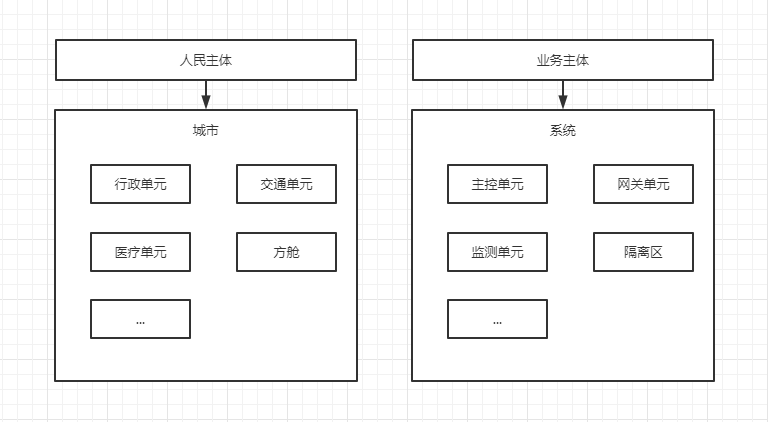

# bat
network architecture mapping reality

尊敬的github社区朋友们：  
&emsp;&emsp;今天是让人难过的一天。从朋友哪里听闻郑州爆发疫情，且发生
了一些不好的事情，让人叹息。 本人是上海疫情的亲历者，同样是一段让人倍感
深刻时间。郑州和上海疫情的爆发和处理有很多相似或不同的地方。相同的地方
如核酸检测，封闭管控，方舱等， 而且同样都发生了一些让人悲伤的恶性事件。  
&emsp;&emsp;我把核酸检测理解为检测，把封闭管控等影响正常生产生活的措
施理解为服务降级，把恶行事件理解为业务丢弃。同样，我把一座城市理解为网
络系统，把医院或者方舱理解为隔离区。像这样，我得到一个现实映射到网络架
构的架构图。  
  
简单的进行分析：由于疫情爆发，业务量激增，发生系统过载，主要是医疗单元
的过载。系统采取方舱等扩容手段，但扩容手段因其延迟性或资源有限等原因未
能有效控制过载。在这一过程中，过载条件可能也激活了其它潜藏病毒，感染其他
单元，加剧过载程度。然后导致服务降级，甚至导致业务丢弃的严重情况发生。   
&emsp;&emsp;个人能力有限，只能构建如上简略的架构图。所以我希望有人能
补充它，构建现实与计算机网络架构的映射。并且以此映射后的架构图从各个角度
如过载控制，故障管理，故障影响分析等角度描述正在 发生的郑州疫情，或者年
初的上海疫情，或者自2019年开始持续到现在的疫情。
以架构图为基础，用计算机领域的相关概念进行分析，尝试进行根因分析，提出你
认为的消减措施。进行红蓝对抗，尝试演进架构模型。  
&emsp;&emsp;人们一直在研究计算机，并且计算机相关领域已经取得很多成果。
那么用计算机来研究人类呢？如果你有 任何想法，欢迎参与。  
&emsp;&emsp;蝙蝠有祈福，幸福的意思。我不知道这么做是不是真的有意义。但是
我实在受不了它了。  
&emsp;&emsp;此致  
敬礼  
&emsp;&emsp;&emsp;&emsp;&emsp;&emsp;&emsp;&emsp;&emsp;&emsp;
&emsp;&emsp;&emsp;&emsp;&emsp;&emsp;&emsp;&emsp;&emsp;&emsp;&emsp;&emsp;&emsp;&emsp;&emsp;2022/10/28

